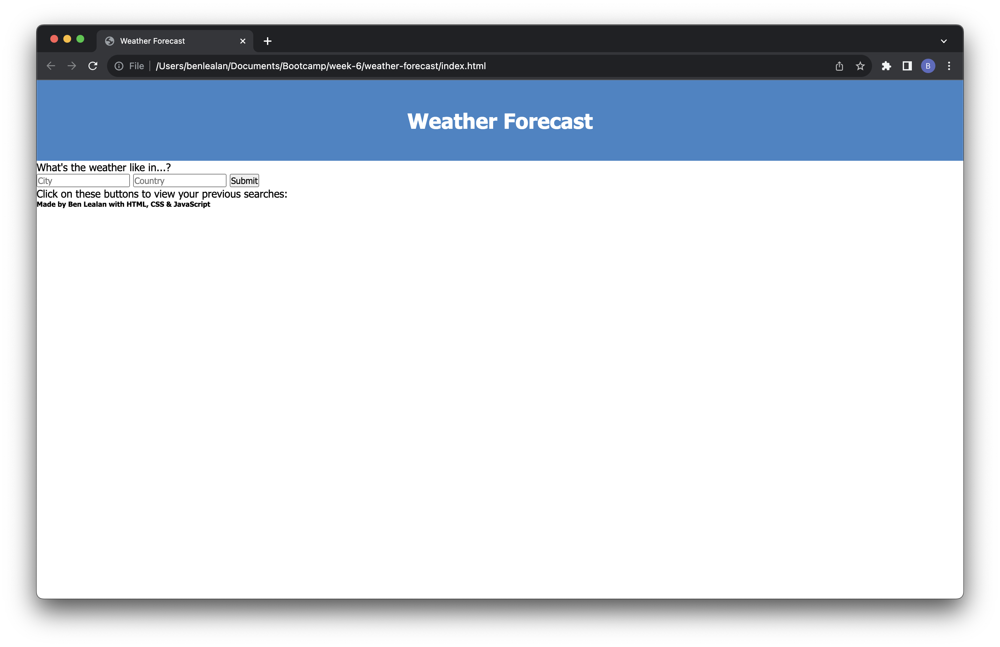
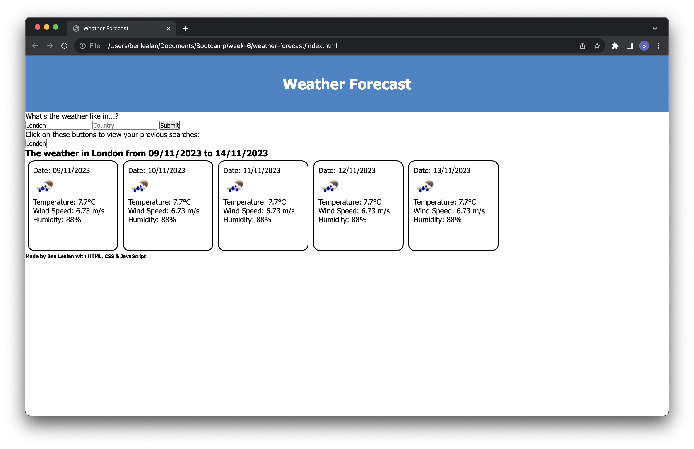
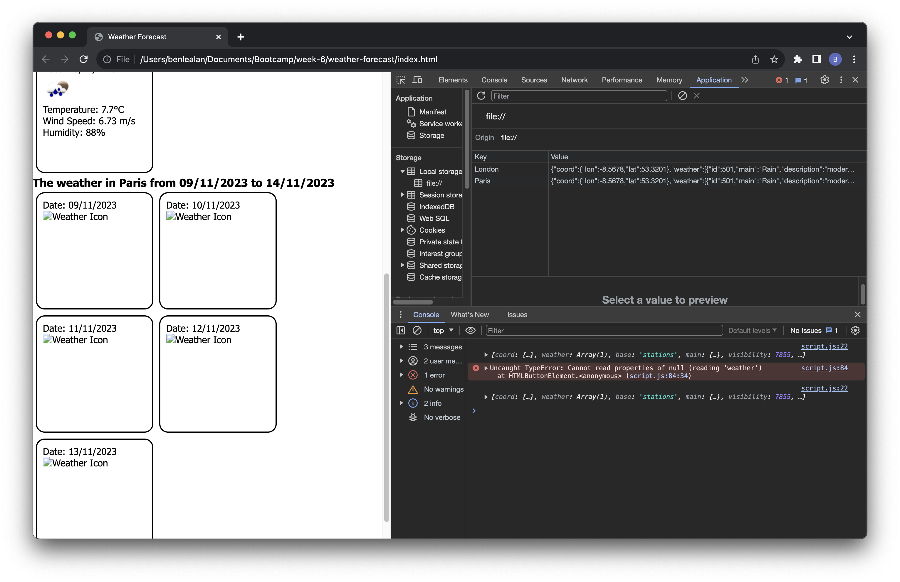

# City Weather Forecast Dashboard

## Description

This was developed with the aim of providing the user the means to search for a five day weather forecast for any city. A history of searches should also be available in order for the user to compare results.

Some basic HTML elements were written as a skeleton, but a lot of elements are created dynamically with JavaScript, responding to the user's input. 

Since the OpenWeather API needs co-ordinates (latitude and longitude) these first needed to be gathered. However, after trying to use the OpenWeather geolocation and being unable to return anything, I instead used an API from API Ninjas (found in sources below). This only needed a text input from the user search to return the data, and the co-ordinates from which were saved to variables. The OpenWeather API fetch request could then be completed with these variables, and saved to local storage as the value, while the searched city is the key.

The basic data for the weather (icon, temperature, wind speed and humidity) were extracted from the saved object, and inserted into the display cards for the user. A response from stackoverflow (link in sources) enabled me to convert the icon code into an image. Dayjs was also used to dynamically display the date of the weather.

However, I encountered a few issues that I was not able to solve before submitting. The page is populated before the data from the fetch request loads, and as a result the weather cards are missing the data. However, if the page is reloaded and the existing local storage kay:value is used again, it will return fill the boxes with temp, icon etc. The fetch request also seems to return the same city co-ordinates. I also need to create a function for the previous search buttons to repopulate the cards from the local storage using "this".

## Usage

Below is a link to the live site and screenshots of the page showing it deployed:

- 

## Credits

- https://api-ninjas.com/api/geocoding
- https://openweathermap.org/current
- https://stackoverflow.com/questions/7342957/how-do-you-round-to-one-decimal-place-in-javascript
- https://stackoverflow.com/questions/44177417/how-to-display-openweathermap-weather-icon
- https://stackoverflow.com/questions/63222396/5-day-weather-forecast-on-openweathermap-not-giving-expected-result